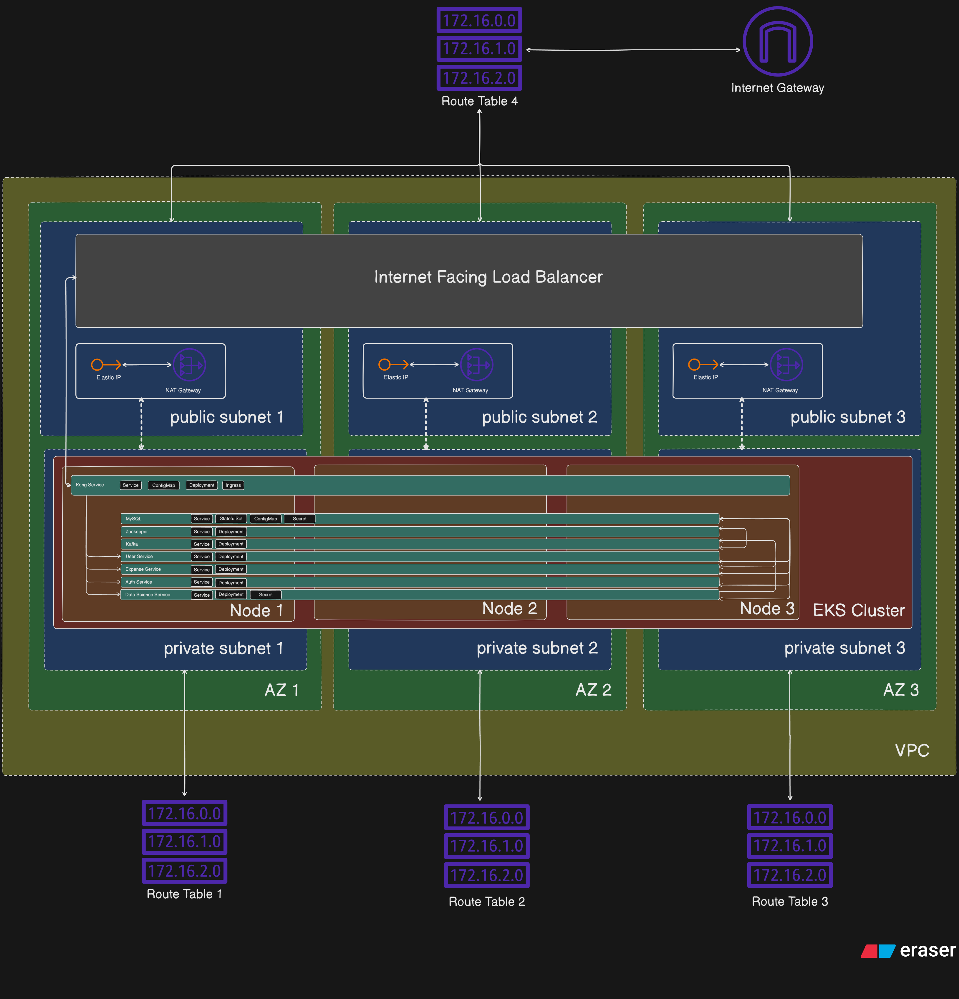
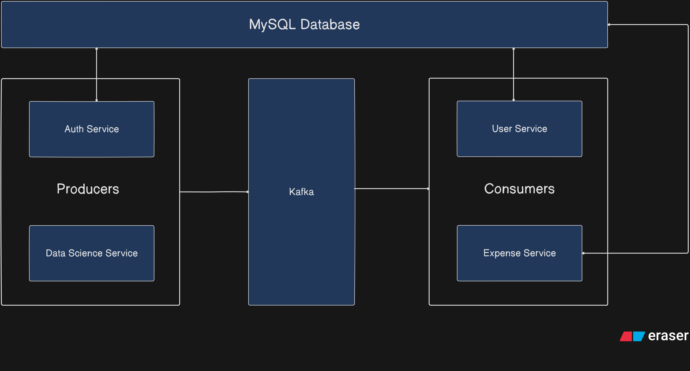

# Expense Tracker

Expense Tracker is a **microservices-based** application that analyzes SMS
notifications on a user's mobile phone to identify recent expenses. When an
expense-related message is detected, the service extracts relevant information
(like amount, merchant) using `Mistral AI` and stores it in a database for easy
tracking.

## Microservices

### Auth Service

- **Github URL** : https://github.com/kapil4457/Expense-Tracker---Auth-Service
- It handles the account creation and login functionality. It uses the concept
  of access token and refresh token to accomodate these functionalities. It
  stores the refresh token and userId with itself. It also publishes the user
  info while creating the account to Kafka.

### User Service

- **Github URL** : https://github.com/kapil4457/Expense-Tracker---User-Service
- It handles storing and fetching user information like name, email address,
  etc. It gets that information from Kafka, which is published by Auth Service.

### Data Science Service

- **Github URL** :
  https://github.com/kapil4457/Expense-Tracker---Data-Science-Service
- It handles extracting the expense info like amount, merchant, etc and then
  publish that information into Kafka. It uses `Mistral AI` to perform the
  extraction.

### Expense Service

- **Github URL** :
  https://github.com/kapil4457/Expense-Tracker---Expense-Service
- It handles storing and fetching the expense information for a user. It gets
  that info from Kafka, which is published by Expense Service.

## Tech Stack

- **Backend** : Java (Spring Boot) , Python (Flask)
- **AI** : Mistral AI
- **AWS Services** : VPC, Subnets, EKS, NAT Gateway, Elastic IP, Internet
  Gateway
- **Orchestration** : Kubernetes(EKS), Docker, ArgoCD
- **CI/CD** : Github Actions
- **Infrastructure** : Terraform

## Architecture Diagram

## Flow Diagram

